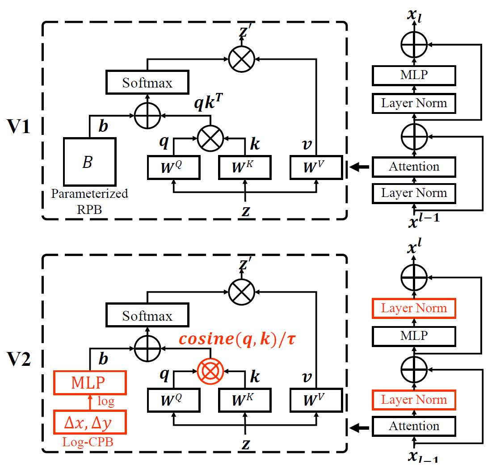

# Swin Unet V2

Swin Unet V2 is a modified version of Swin Unet [arxiv](https://arxiv.org/pdf/2105.05537) based on Swin Transfomer V2 [arxiv](https://arxiv.org/pdf/2111.09883).

All configurations are the same as [Swin Unet](https://github.com/HuCaoFighting/Swin-Unet).

You just need to download the **network** folder and replace the **network** folder in [Swin Unet](https://github.com/HuCaoFighting/Swin-Unet).

<p align="center">

    <h4 align="center">Comparison of the WindowAttention module between Swin Transformer V1 and Swin Transformer V2</h4>
</p>

## Reference
```bibtex
@misc{cao2021swinunet,
      title={Swin-Unet: Unet-like Pure Transformer for Medical Image Segmentation}, 
      author={Hu Cao and Yueyue Wang and Joy Chen and Dongsheng Jiang and Xiaopeng Zhang and Qi Tian and Manning Wang},
      year={2021},
      eprint={2105.05537},
      archivePrefix={arXiv},
      primaryClass={eess.IV}
}
@article{liu2021swin,
  title={Swin Transformer V2: Scaling Up Capacity and Resolution},
  author={Liu, Ze and Hu, Han and Lin, Yutong and Yao, Zhuliang and Xie, Zhenda and Wei, Yixuan and Ning, Jia and Cao, Yue and Zhang, Zheng and Dong, Li and others},
  journal={arXiv preprint arXiv:2111.09883},
  year={2021}
}
```

